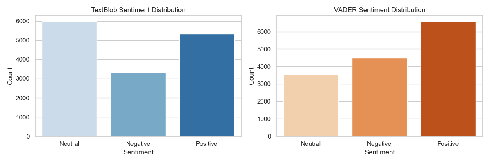
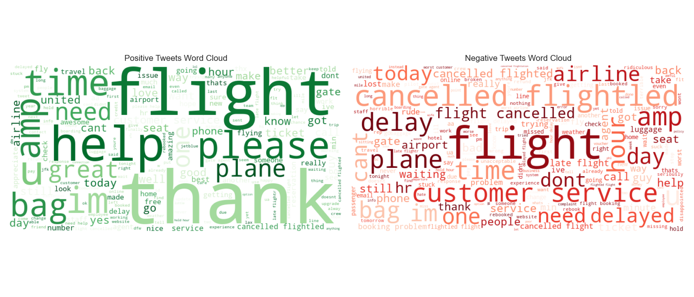

# ✈️ Twitter Sentiment Analysis using NLP – US Airline Case Study

This project is submitted as **Task 2** of the Brainwave Matrix Internship program. It demonstrates how to analyze social media data (Twitter) using **Natural Language Processing (NLP)** to extract sentiment, uncover trends, and visualize public opinion on various U.S. airlines.

---

## 📌 Project Objective

To understand public sentiment toward U.S. airlines by analyzing real-world tweets using NLP techniques. The goal is to preprocess tweet data, apply sentiment scoring (TextBlob & VADER), and visualize insights such as emotion trends, top complaint keywords, and airline-wise sentiment distribution.

---

## 📁 Dataset

- Source: [Kaggle – Twitter US Airline Sentiment](https://www.kaggle.com/datasets/crowdflower/twitter-airline-sentiment)
- Records: ~14,000 tweets mentioning major U.S. airlines
- Key Columns: `text`, `airline_sentiment`, `airline`, `tweet_created`

---

## 🔍 Key Steps

### 1. Text Preprocessing (NLP)
- Lowercasing, punctuation removal
- URL, hashtag, and mention removal
- Stopword removal and lemmatization

### 2. Sentiment Scoring
- **TextBlob**: Polarity score-based sentiment
- **VADER**: Compound score-based sentiment (optimized for social media)

### 3. Data Visualization
- 📊 Sentiment distribution (bar plots)
- 🆚 TextBlob vs VADER comparison
- 🧠 Sentiment by airline (grouped bars)
- ☁️ WordClouds for positive vs. negative tweets
- 📈 Time-based sentiment trends using `tweet_created`

---

## 📊 Sample Visuals

| Sentiment Distribution | WordCloud |
|------------------------|-----------|
|  |  |

---

## 🛠️ Tools & Libraries

- `Python`, `Pandas`, `Matplotlib`, `Seaborn`
- `NLTK`, `TextBlob`, `VADER`, `WordCloud`
- Jupyter Notebook (IPYNB)

---

## 📂 Folder Structure

Brainwave_Matrix_Intern_Task_2/
│
├── twitter_sentiment_analysis.csv           # Raw dataset
├── twitter_sentiment_analysis.ipynb         # Main notebook
├── cleaned_tweets.csv                       # Preprocessed output
├── README.md                                # Full project documentation
│
└── images/                                  # Visualizations for LinkedIn & GitHub
    ├── vader_distribution.png
    └── wordcloud.png

---

## 📢 LinkedIn Showcase

I’ve shared the key outcomes of this project on [LinkedIn](https://www.linkedin.com/in/ronak-patel1790) with visuals and video.  
Follow me for more project breakdowns in Data Science & Analytics.

---

## 📬 Contact

**Ronak Patel**  
📧 ronakpatel171990@gmail.com  
🌐 [GitHub Portfolio](https://github.com/ronak171990)

---

⭐ If you liked this project, give it a ⭐️ on GitHub and follow for more updates!
